## WCAG 2.1 새로운 성공 기준.

W3C는 2018년 6월 5일 [WCAG 2.1](https://www.w3.org/TR/WCAG21/) 권고안(Recommendation)을 공개했습니다. 새로 발표한 권고안은 [WCAG 2.0](https://www.w3.org/TR/WCAG20/) 버전의 모든 항목을 계승하고 새로운 지침을 추가한 것입니다. 새로운 성공 기준을 '원문, 번역, 해설, 참고' 순으로 정리했습니다. 새로운 성공 기준은 모두 17개로 각각 A 5개, AA 7개, AAA 5개 입니다.

* [1.3.4 Orientation (Level AA)](#134-orientation-level-aa)
* [1.3.5 Identify Input Purpose (Level AA)](#135-identify-input-purpose-level-aa)
* [1.3.6 Identify Purpose (Level AAA)](#136-identify-purpose-level-aaa)
* [1.4.10 Reflow (Level AA)](#1410-reflow-level-aa)
* [1.4.11 Non-text Contrast (Level AA)](#1411-non-text-contrast-level-aa)
* [1.4.12 Text Spacing (Level AA)](#1412-text-spacing-level-aa)
* [1.4.13 Content on Hover or Focus (Level AA)](#1413-content-on-hover-or-focus-level-aa)
* [2.1.4 Character Key Shortcuts (Level A)](#214-character-key-shortcuts-level-a)
* [2.2.6 Timeouts (Level AAA)](#226-timeouts-level-aaa)
* [2.3.3 Animation from Interactions (Level AAA)](#233-animation-from-interactions-level-aaa)
* [2.5.1 Pointer Gestures (Level A)](#251-pointer-gestures-level-a)
* [2.5.2 Pointer Cancellation (Level A)](#252-pointer-cancellation-level-a)
* [2.5.3 Label in Name (Level A)](#253-label-in-name-level-a)
* [2.5.4 Motion Actuation (Level A)](#254-motion-actuation-level-a)
* [2.5.5 Target Size (Level AAA)](#255-target-size-level-aaa)
* [2.5.6 Concurrent Input Mechanisms (Level AAA)](#256-concurrent-input-mechanisms-level-aaa)
* [4.1.3 Status Messages (Level AA)](#413-status-messages-level-aa)

### 1.3.4 Orientation (Level AA)
#### 원문
> **1.3.4 Orientation (Level AA)**<br>
> Content does not restrict its view and operation to a single display orientation, such as portrait or landscape, unless a specific display orientation is [essential](https://www.w3.org/TR/WCAG21/#dfn-essential).
>
> **NOTE**<br>
> Examples where a particular display orientation may be essential are a bank check, a piano application, slides for a projector or television, or virtual reality content where binary display orientation is not applicable.

#### 번역
> **1.3.4 방향 (Level AA)**<br>
> 콘텐츠는 세로 또는 가로와 같이 한 방향으로만 표시하거나 작동하도록 제한하지 않아야 한다. 특정 방향 표시가 [반드시 필요한](https://www.w3.org/TR/WCAG21/#dfn-essential) 경우는 예외.
>
> **참고**<br>
> 특정 디스플레이 방향이 반드시 필요할 수 있는 예로는 은행 수표, 피아노 애플리케이션, 프로젝터나 텔레비전용 슬라이드 또는 바이너리 표시 방향을 적용할 수 없는 가상현실 콘텐츠가 있다.

#### 해설
콘텐츠 탐색 방향을 한 방향으로 제한하지 않아야 한다. 이 성공 기준을 준수하면 선호에 따라 특정 방향으로 고정 후 탐색하는 사용자를 도울 수 있다.

일부 사용자는 휴대용 단말기를 휠체어에 고정하기 때문에 특정 방향으로만 탐색할 수 있다. 일부 사용자는 시력이 약해서 화면을 확대한 상태로 특정 방향으로 탐색하기를 선호한다. 웹 문서를 가로 또는 세로 중 한 방향으로만 탐색할 수 있도록 제한하면 콘텐츠를 이용하기 어려운 사용자가 있다.

[휠체어에 세로 방향으로 고정한 단말]<br>
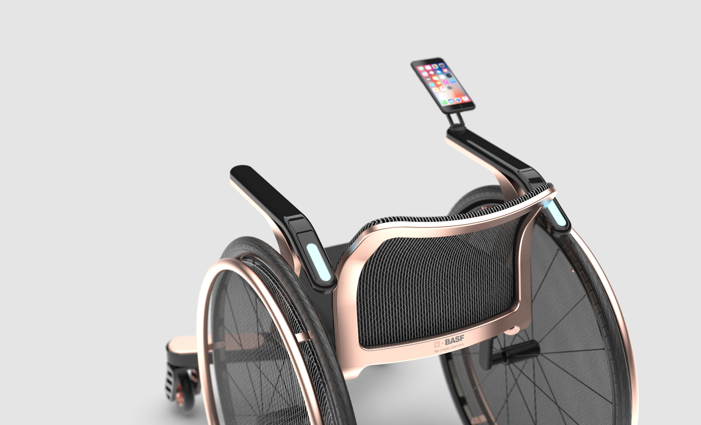<br>
출처 - [https://www.rehto.co.kr/](https://www.rehto.co.kr/basf-wheelchair-project-a)

[방향 고정이 필수적인 콘텐츠 예]<br>
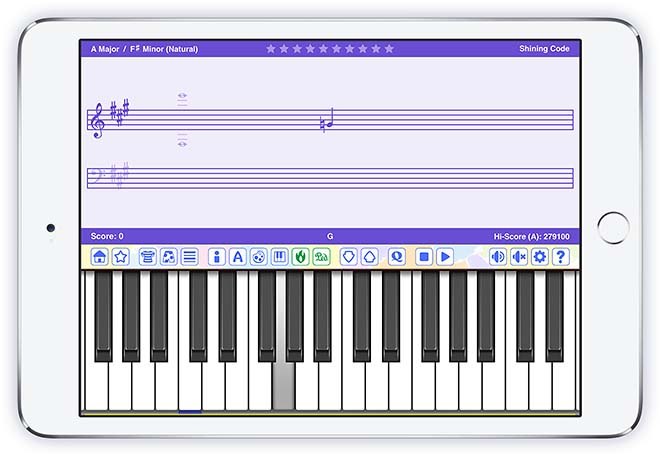<br>
출처 - [http://www.shiningcode.com/](http://www.shiningcode.com/shiningcode/02_en/sight-reading-app-ipad.html)

#### 참고
* [Understanding Success Criterion 1.3.4: Orientation](https://www.w3.org/WAI/WCAG21/Understanding/orientation.html)
* [Failure due to locking the orientation to landscape or portrait view](https://www.w3.org/WAI/WCAG21/Techniques/failures/F97)


### 1.3.5 Identify Input Purpose (Level AA)
#### 원문
> **1.3.5 Identify Input Purpose**<br>
> The purpose of each input field collecting information about the user can be [programmatically determined](https://www.w3.org/TR/WCAG21/#dfn-programmatically-determinable) when:
>
> * The input field serves a purpose identified in the [Input Purposes for User Interface Components section](https://www.w3.org/TR/WCAG21/#input-purposes); and
> * The content is implemented using technologies with support for identifying the expected meaning for form input data.

#### 번역
> **1.3.5 입력 용도 식별 (Level AA)**<br>
> 사용자 정보를 수집하는 각 입력 필드의 용도를 [프로그램으로 결정](https://www.w3.org/TR/WCAG21/#dfn-programmatically-determinable)한다. 다음 경우에 한함.
>
> * 입력 필드를 [사용자 인터페이스 구성요소를 위한 입력 목적 섹션](https://www.w3.org/TR/WCAG21/#input-purposes)에서 식별한 용도로 사용할 때
> * 콘텐츠가 서식 입력 데이터의 예상할 수 있는 의미를 식별할 수 있도록 지원하는 기법을 사용하여 실행할 때

#### 해설
이 성공 기준은 사용자 정보 입력 필드의 용도를 구체적으로 명시하여 손쉽게 채울(`autocomplete`) 수 있도록 돕는다.

프로그램으로 결정한다는 것은 보조기기가 해석 가능한 방식으로 마크업한다는 것을 의미한다. 유저 에이전트와 보조기기는 [사용자 인터페이스 구성요소를 위한 입력 목적 섹션](https://www.w3.org/TR/WCAG21/#input-purposes)에 명시한 것만 해석할 수 있다.

생년월일을 입력받기 위해 `<input>` 요소를 마크업할 때 `type="date"` 만으로는 충분하지 않다. `autocomplete="bday"` 속성을 명시함으로써 "날짜"보다 더 구체적인 "생일"이라는 정보를 제공하고 유저 에이전트가 지원하는 자동완성 기능을 사용할 수 있다. 추가로 `autocomplete="bday"` 요소에 생일 케이크 아이콘을 제공하면 문자보다 이미지에 의존하는 사람을 돕는다.

이 성공 기준을 준수하면 유저 에이전트의 자동완성 기능을 사용할 수 있고 사용자는 입력 양식을 채우기 위해 기억 능력과 운동 능력에 의존하지 않아도 된다. 입력 필드에 아이콘 이미지를 추가하면 문자 판독 능력에 의존하지 않아도 된다.

[입력 필드 용도를 프로그램으로 결정한 예제 코드]
```html
<label for="birthday">생년월일:</label>
<input id="birthday" type="date" autocomplete="bday">
```
```css
[autocomplete="bday"] {
    background: url("../img/birthday-cake-icon.png") no-repeat 0;
}
```

[생일 인풋에 달력 대신 케이크 아이콘을 제공]<br>
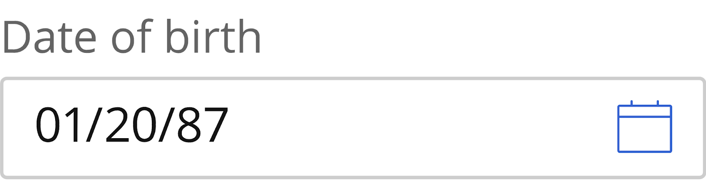
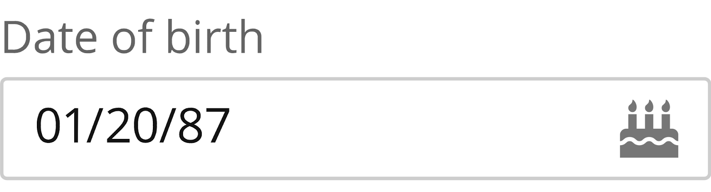<br>

#### 참고
* [Understanding Success Criterion 1.3.5: Identify Input Purpose](https://www.w3.org/WAI/WCAG21/Understanding/identify-input-purpose.html)
* [Using HTML 5.2 autocomplete attributes](https://www.w3.org/WAI/WCAG21/Techniques/html/H98)
* [HTML 5.2 - 4.10.18.7. Autofill](https://www.w3.org/TR/html52/sec-forms.html#autofill)


### 1.3.6 Identify Purpose (Level AAA)
#### 원문
> **1.3.6 Identify Purpose (Level AAA)**<br>
> In content implemented using markup languages, the purpose of [User Interface Components](https://www.w3.org/TR/WCAG21/#dfn-user-interface-components), icons, and [regions](https://www.w3.org/TR/WCAG21/#dfn-regions) can be [programmatically determined](https://www.w3.org/TR/WCAG21/#dfn-programmatically-determinable).

#### 번역
> **1.3.6 용도 식별 (Level AAA)**<br>
> 마크업 언어로 구현한 콘텐츠에서 [사용자 인터페이스 구성요소](https://www.w3.org/TR/WCAG21/#dfn-user-interface-components), 아이콘 및 [영역](https://www.w3.org/TR/WCAG21/#dfn-regions)의 용도는 [프로그램으로 결정](https://www.w3.org/TR/WCAG21/#dfn-programmatically-determinable)한다.

#### 해설
보조기기가 이해할 수 있도록 용도를 구체적으로 명시한 콘텐츠는 개인에 알맞는 방식으로 강조하거나 또는 숨길 수 있다. 즉, 이 성공 기준은 개인화를 지원하기 위한 의도를 담고 있다.

사용자 인터페이스 구성요소는 폼 컨트롤과 링크를 의미한다. 영역(regions)은 랜드마크 역할(landmark role)로 해석할 수 있는 영역(예를 들면 `<main>` 요소 또는 `role="main"` 요소)을 의미한다. 프로그램으로 결정한다는 것은 보조기기가 해석 가능한 방식으로 마크업한다는 것을 의미한다.

이 성공 기준을 준수하면 기억, 집중, 언어, 실행과 결정 장애가 있는 사용자를 도울 수 있다. 익숙한 기호, 적은 기능, 키보드 단축키 지원이 필요한 사람을 돕는다.

WAI-ARIA 랜드마크 역할을 사용하여 개인에게 유익한 콘텐츠를 식별하고, 개인에게 의미 없는 내용은 숨길 수 있다. 예를 들면 웹 페이지에서 `<main>` 또는 `role="main"` 영역을 나에게 필요한 영역으로 판단하여 강조할 수 있다. 그리고 `<aside>` 또는 `role="complementary"` 영역을 나에게 불필요한 영역으로 판단하여 숨길 수 있다.

[개인의 선호에 따라 콘텐츠를 숨길 수 있음]<br>
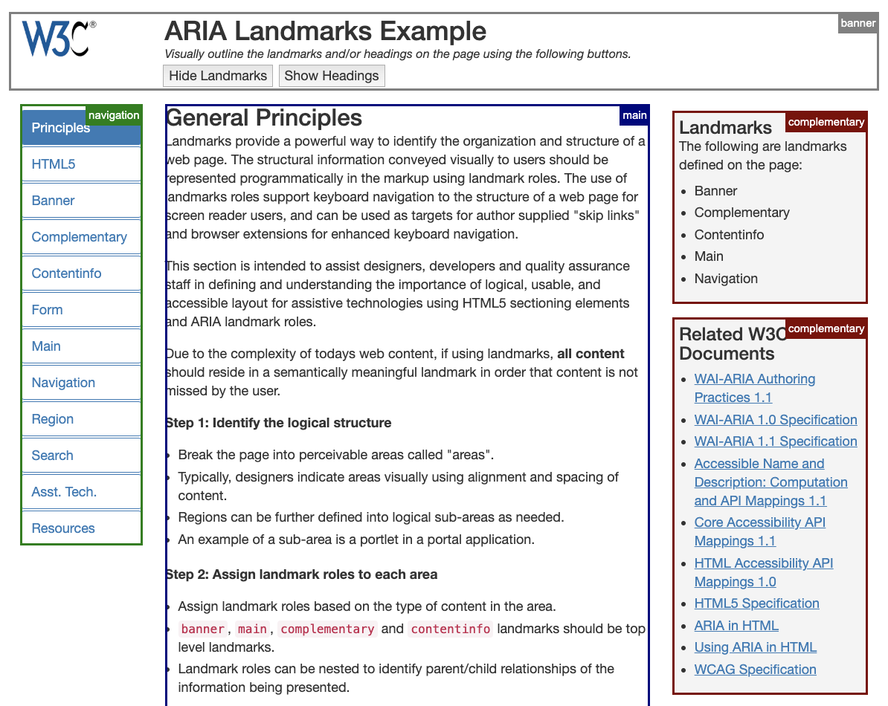
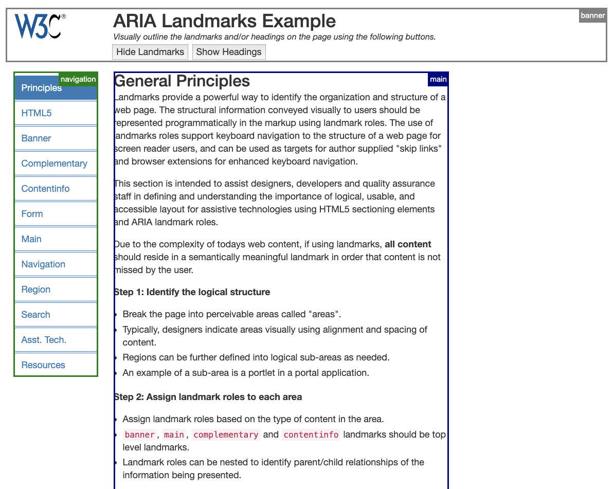<br>

#### 참고
* [Understanding Success Criterion 1.3.6: Identify Purpose](https://www.w3.org/WAI/WCAG21/Understanding/identify-purpose.html)
* [ARIA Landmarks Example](https://www.w3.org/TR/2017/NOTE-wai-aria-practices-1.1-20171214/examples/landmarks/)


### 1.4.10 Reflow (Level AA)
#### 원문
> **1.4.10 Reflow (Level AA)**<br>
> Content can be presented without loss of information or functionality, and without requiring scrolling in two dimensions for:
>
> * Vertical scrolling content at a width equivalent to 320 [CSS pixels](https://www.w3.org/TR/WCAG21/#dfn-css-pixels);
> * Horizontal scrolling content at a height equivalent to 256 [CSS pixels](https://www.w3.org/TR/WCAG21/#dfn-css-pixels).
>
> Except for parts of the content which require two-dimensional layout for usage or meaning.
>
> **NOTE**<br>
> Note: 320 CSS pixels is equivalent to a starting viewport width of 1280 CSS pixels wide at 400% zoom. For web content which are designed to scroll horizontally (e.g. with vertical text), the 256 CSS pixels is equivalent to a starting viewport height of 1024px at 400% zoom.
>
> **NOTE**<br>
> Examples of content which require two-dimensional layout are images, maps, diagrams, video, games, presentations, data tables, and interfaces where it is necessary to keep > toolbars in view while manipulating content.

#### 번역
> **1.4.10 리플로우 (Level AA)**<br>
> 콘텐츠는 정보 또는 기능 손실 없이, 2차원 스크롤 없이 제공해야 한다. 2차원 스크롤은 다음을 의미한다.
>
> * 320 [CSS 픽셀](https://www.w3.org/TR/WCAG21/#dfn-css-pixels)에 해당하는 너비에서 콘텐츠를 수직으로 스크롤 그리고
> * 256 [CSS 픽셀](https://www.w3.org/TR/WCAG21/#dfn-css-pixels)에 해당하는 높이에서 콘텐츠를 수평으로 스크롤
>
> 활용 또는 의미상 2차원 레이아웃이 필요한 콘텐츠는 제외.
>
> **참고**<br>
> 너비 320 CSS 픽셀은 너비 초기값 1280 CSS 픽셀인 뷰포트(viewport)를 400% 확대한 크기와 같다. 수평으로 스크롤하도록 설계한 웹 콘텐츠(예: 수직 텍스트)의 경우, 높이 256 CSS 픽셀은 높이 초기값 1024 CSS 픽셀 뷰포트를 400% 확대한 크기와 같다.
>
> **참고**<br>
> 2차원 레이아웃이 필요한 콘텐츠 예로는 이미지, 지도, 다이어그램, 비디오, 게임, 프레젠테이션, 데이터 테이블, 그리고 콘텐츠를 조작하는 화면에서 도구모음(toolbar)을 유지할 필요가 있는 인터페이스가 있다.

#### 해설
화면을 400%까지 확대하는 경우 콘텐츠를 선형화해서 한 방향으로만 스크롤하도록 구현해야 한다. 반응형 웹 구현 방식과 같다.

데스크톱 화면에서 뷰포트를 1280 * 1024 CSS 픽셀으로 조정한 다음 화면을 400%까지 확대하여 320 * 256 CSS 픽셀이 되었을 때 2차원 스크롤이 발생하지 않도록 구현하면 된다. 모바일 단말에서 핀치 줌(두 손가락 줌)하는 경우를 의미하지 않는다.

리플로우(reflow)라는 것은 유저 에이전트가 화면 크기에 알맞게 한 방향으로만 스크롤할 수 있도록 콘텐츠 흐름을 다시 처리한 것을 의미한다.

CSS 픽셀은 다른 표현으로 논리 픽셀이라고 부르기도 한다. 단말에서 실제로 표현할 수 있는 가장 작은 단위의 한 점이 물리 픽셀이라면 소프트웨어가 표현할 수 있는 가장 작은 점은 논리 픽셀(CSS 픽셀)이다.

이 성공 기준을 준수하면 시력이 약한 사람이 화면을 확대해서 콘텐츠를 이용하는 것을 돕는다. 화면을 확대했을 때 2차원 스크롤이 발생하면 콘텐츠를 이용하기 매우 어렵다.

[반응형 웹 예제]<br>


<br>
출처 - [https://www.iconfinder.com/](https://www.iconfinder.com/iconsets/technology-mix)

#### 참고
* [Understanding Success Criterion 1.4.10: Reflow](https://www.w3.org/WAI/WCAG21/Understanding/reflow.html)


### 1.4.11 Non-text Contrast (Level AA)
#### 원문
> **1.4.11 Non-text Contrast (Level AA)**<br>
> The visual [presentation](https://www.w3.org/TR/WCAG21/#dfn-presentation) of the following have a [contrast ratio](https://www.w3.org/TR/WCAG21/#dfn-contrast-ratio) of at least 3:1 against adjacent color(s):
>
> * **User Interface Components:** Visual information required to identify [user interface components](https://www.w3.org/TR/WCAG21/#dfn-user-interface-components) and [states](https://www.w3.org/TR/WCAG21/#dfn-states), except for inactive components or where the appearance of the component is determined by the user agent and not modified by the author;
> * **Graphical Objects:** Parts of graphics required to understand the content, except when a particular presentation of graphics is [essential](https://www.w3.org/TR/WCAG21/#dfn-essential) to the information being conveyed.

#### 번역
> **1.4.11 텍스트 아닌 콘텐츠 명도대비 (Level AA)**<br>
> 시각 [표현](https://www.w3.org/TR/WCAG21/#dfn-presentation)은 주변 색상과 비교하여 [명도 대비](https://www.w3.org/TR/WCAG21/#dfn-contrast-ratio)가 최소 3:1 이상이어야 한다. 다음 경우에 한함.
>
> * **사용자 인터페이스 구성요소:** [사용자 인터페이스 구성요소](https://www.w3.org/TR/WCAG21/#dfn-user-interface-components) 및 [상태](https://www.w3.org/TR/WCAG21/#dfn-states)를 식별하기 위해 필요한 시각 정보. 비활성 구성요소 또는 구성요소 형태를 사용자 에이전트가 결정하고 개발자가 수정할 수 없는 경우는 예외.
> * **그래픽 객체:** 내용을 이해하는데 필요한 그래픽. 특정 그래픽 표현이 정보 전달에 [반드시 필요한](https://www.w3.org/TR/WCAG21/#dfn-essential) 경우는 예외.

#### 해설
링크, 폼 콘트롤, 정보 전달용 그래픽 색상은 주변 색상과 비교할 때 3:1 이상의 명도 대비가 있어야 한다. 사용할 수 없음을 알리기 위한 구성요소는 예외. 이 성공 기준은 시력이 약한 사용자가 텍스트 아닌 콘텐츠를 인지할 수 있도록 돕는다.

사용자 인터페이스 구성요소는 링크, 폼 콘트롤을 의미한다. 이 성공 기준에서 그래픽 객체는 정보 전달을 위한 그래픽으로 아이콘 또는 인포그래픽이 이에 해당한다. 브랜드 심볼 또는 정보 전달을 의도하지 않은 그래픽은 예외다.

[성공 기준을 만족하는 링크: 링크 밑줄과 초점 아웃라인 명도 대비가 충분하다. 텍스트 명도 대비도 충분하다. 텍스트 명도 대비는 성공 기준 1.4.3에서 평가해야 한다.]<br>
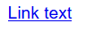
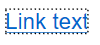<br>

[성공 기준을 만족하는 폼 콘트롤: 보더와 면의 명도 대비가 충분하다.]<br>
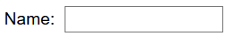<br>
<br>

[사용할 수 없음을 알리기 위한 콘트롤: 비활성을 의도한 디자인은 성공 기준을 만족할 필요가 없다.]<br>
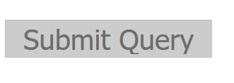<br>

[성공 기준을 만족하는 아이콘: 아이콘과 주변의 경계 색상의 대비가 충분하다.]<br>
<br>

[성공 기준을 만족하는 선 그래프: 배경색과 비교하여 명도 대비가 충분하다. 각 선을 식별할 수 있는 고유한 패턴도 있다. 색상이 유일한 식별 수단이 아니므로 1.4.1 기준도 만족함.]<br>
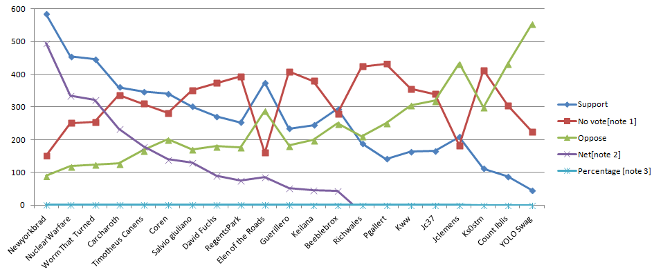<br>

[성공 기준을 만족하는 파이 그래프: 파이 경계를 분리해서 명도 대비를 확보했다. 명도 대비가 불충분한 경우 진한 보더를 넣어서 충분한 대비를 제공.]<br>
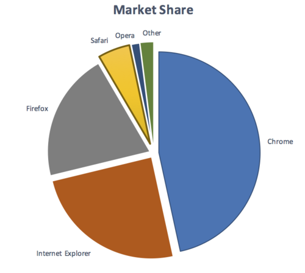<br>

#### 참고
* [Understanding Success Criterion 1.4.11: Non-text Contrast](https://www.w3.org/WAI/WCAG21/Understanding/non-text-contrast.html)


### 1.4.12 Text Spacing (Level AA)
#### 원문
> **1.4.12 Text Spacing (Level AA)**<br>
> In content implemented using markup languages that support the following [text](https://www.w3.org/TR/WCAG21/#dfn-text) [style properties](https://www.w3.org/TR/WCAG21/#dfn-style-properties), no loss of content or functionality occurs by setting all of the following and by changing no other style property:
>
> * Line height (line spacing) to at least 1.5 times the font size;
> * Spacing following paragraphs to at least 2 times the font size;
> * Letter spacing (tracking) to at least 0.12 times the font size;
> * Word spacing to at least 0.16 times the font size.
>
> Exception: Human languages and scripts that do not make use of one or more of these text style properties in written text can conform using only the properties that exist for that combination of language and script.

#### 번역
> **1.4.12 텍스트 간격 (Level AA)**<br>
> [텍스트](https://www.w3.org/TR/WCAG21/#dfn-text) [스타일 속성](https://www.w3.org/TR/WCAG21/#dfn-style-properties)을 지원하는 마크업 언어를 사용하여 콘텐츠를 구현했을 때 다른 스타일 속성 변경 없이 다음과 같이 설정한 후 콘텐츠나 기능을 유지해야 한다.
>
> * 줄 간격은 글자 크기의 1.5배 이상
> * 문단 사이 간격은 글자 크기의 2배 이상
> * 글자 간격은 글자 크기의 0.12배 이상
> * 단어 간격은 글자 크기보다 0.16배 이상
>
> 예외: 필기(written text)에서 이런 스타일 속성을 사용하지 않은 인간 언어(human language)와 원고(script)는 적용 가능한 속성만 사용하여 준수할 수 있다.

#### 해설
이 성공 기준은 사용자가 텍스트 스타일을 다시 정의(변경)했을 때 콘텐츠 또는 기능을 상실하지 않도록 구현해야 한다는 것을 의미한다.

이 성공 기준은 사용자가 텍스트 스타일을 다시 정의하는 것을 보장함으로써 시력이 약하거나 난독증 있는 사람의 독서 경험을 향상시키는데 목적이 있다. 제작자는 이 성공 기준이 제시하는 스타일대로 텍스트 간격을 제공하지 않아도 된다.

사용자가 줄 간격(line-height), 문단 사이 간격(margin-top, margin-bottom), 자간(letter-spacing), 단어 간격(word-spacing)을 성공 기준이 제시한 수준으로 조정했을 때 일부 콘텐츠가 잘리거나 겹치면 성공 기준을 만족하지 않는다.

[줄 간격을 조절할 때 텍스트가 잘리는 실패 사례]<br>
<br>

[자간을 조절할 때 텍스트가 잘리는 실패 사례]<br>
<br>

[줄 간격을 조절할 때 텍스트가 겹치는 실패 사례]<br>
<br>

#### 참고
* [Understanding Success Criterion 1.4.12: Text Spacing](https://www.w3.org/WAI/WCAG21/Understanding/text-spacing.html)


### 1.4.13 Content on Hover or Focus (Level AA)
#### 원문
> **1.4.13 Content on Hover or Focus (Level AA)**<br>
> Where receiving and then removing pointer hover or keyboard focus triggers additional content to become visible and then hidden, the following are true:
>
> * **Dismissable:** A [mechanism](https://www.w3.org/TR/WCAG21/#dfn-mechanism) is available to dismiss the additional content without moving pointer hover or keyboard focus, unless the additional content communicates an [input error](https://www.w3.org/TR/WCAG21/#dfn-input-error) or does not obscure or replace other content;
> * **Hoverable:** If pointer hover can trigger the additional content, then the pointer can be moved over the additional content without the additional content disappearing;
> * **Persistent:** The additional content remains visible until the hover or focus trigger is removed, the user dismisses it, or its information is no longer valid.
>
> Exception: The visual presentation of the additional content is controlled by the user agent and is not modified by the author.
>
> **NOTE**<br>
> Examples of additional content controlled by the user agent include browser tooltips created through use of the HTML [title attribute](https://www.w3.org/TR/html/dom.html#the-title-attribute).
>
> **NOTE**<br>
> Custom tooltips, sub-menus, and other nonmodal popups that display on hover and focus are examples of additional content covered by this criterion.

#### 번역
> **1.4.13 호버 또는 초점을 받은 콘텐츠 (Level AA)**<br>
> 포인터 호버(hover) 또는 키보드 초점(focus)을 받고 제거함에 따라 추가 콘텐츠를 표시한 다음 숨기는 경우 다음을 준수해야 한다.
>
> * **취소 가능:** 포인터 호버나 키보드 초점 조작 없이 추가 콘텐츠를 취소할 수 있는 [메커니즘](https://www.w3.org/TR/WCAG21/#dfn-mechanism)을 제공해야 한다. 추가 콘텐츠가 [입력 오류](https://www.w3.org/TR/WCAG21/#dfn-input-error)를 전달하거나 다른 내용을 가리거나 바꾸지 않으면 예외.
> * **호버 가능:** 포인터 호버가 추가 콘텐츠를 보여줄 경우 추가 콘텐츠 위로 포인터를 이동할 수 있어야 한다.
> * **지속 가능:** 추가 콘텐츠는 호버 또는 초점을 제거하거나, 사용자가 취소하거나, 또는 정보가 더 이상 유효하지 않을 때까지 볼 수 있어야 한다.
>
> 예외: 추가 콘텐츠 시각 표현을 사용자 에이전트가 제어하고 개발자가 수정할 수 없다면 예외.
>
> **참고**<br>
> 사용자 에이전트가 제어하는 추가 콘텐츠 예로는 HTML [title 속성](https://www.w3.org/TR/html/dom.html#the-title-attribute)을 사용하여 만든 브라우저 툴팁(tooltips)이 있다.
>
> **참고**<br>
> 호버나 포커스를 받으면 표시하는 사용자 정의 툴팁, 하위 메뉴, 모달 아닌(nonmodal) 팝업은 이 성공 기준에서 다루는 추가 콘텐츠 사례들이다.

#### 해설
마우스 호버 또는 키보드 초점으로 추가 콘텐츠를 표시한다면 추가 콘텐츠는 다른 콘텐츠를 방해하지 않아야 한다. 다른 콘텐츠를 방해하는 경우 취소할 수 있어야 한다. 추가 콘텐츠는 사용자가 취소하기 전까지 이용을 보장해야 한다. 마우스 호버 또는 키보드 초점으로 추가 콘텐츠를 표시한다면

1. 다른 내용을 가리는 경우 ESC 키를 이용하여 취소 가능해야 한다.
2. 추가 콘텐츠에 호버 또는 필요한 경우 초점을 이동할 수 있어야 한다.
3. 추가 콘텐츠는 사용자 취소 행위 전까지 볼 수 있어야 한다.

이 성공 기준을 준수하면 화면을 큰 배율로 조정해서 웹을 사용하는 약시 시각 장애인의 탐색을 돕는다. 사용자가 툴팁이나 하위 메뉴를 실수로 활성화하여 다른 콘텐츠를 탐색하는데 방해를 받는다면 쉽게 취소할 수 있다. 추가 콘텐츠를 탐색하려고 추가 콘텐츠에 마우스 호버하거나 초점을 넣을 때 저절로 닫히지 않도록 함으로써 추가 콘텐츠 접근성을 보장할 수 있다.

사용자 정의 툴팁이나 하위 메뉴가 이런 경우에 해당한다. 마우스 호버 또는 키보드 초점으로 제공하는 추가 콘텐츠 대표적인 사례는 다음과 같다.

[추가 콘텐츠가 다른 콘텐츠를 가리지 않는 경우.]<br>
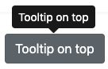
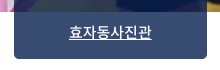<br>
추가 콘텐츠가 다른 콘텐츠를 가리지 않는다면 취소 기능(ESC)을 제공할 필요는 없다. 추가 콘텐츠에 마우스를 호버하거나 초점을 넣을 때 추가 콘텐츠를 여전히 표시하기만 하면 된다.

[추가 콘텐츠가 다른 콘텐츠를 가리는 경우.]<br>
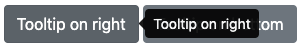
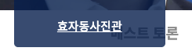<br>
추가 콘텐츠가 다른 콘텐츠를 가리는 경우 추가 콘텐츠 취소 기능을 구현해야 한다. ESC 키를 누를 때 추가 콘텐츠를 표시하지 않도록 구현할 수 있다.

[추가 콘텐츠 탐색을 보장해야 한다.]<br>
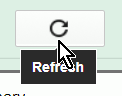
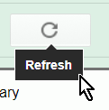<br>
추가 콘텐츠에는 호버 또는 필요한 경우 초점 이동이 가능해야 한다. 추가 콘텐츠가 더 이상 유효하지 않을 때까지 표시해야 한다. 추가 콘텐츠에서 호버를 빼거나 또는 초점을 제거하거나, 취소(ESC)할 때까지 표시해야 한다.

#### 참고
* [Understanding Success Criterion 1.4.13: Content on Hover or Focus](https://www.w3.org/WAI/WCAG21/Understanding/content-on-hover-or-focus.html)


### 2.1.4 Character Key Shortcuts (Level A)
#### 원문
> **2.1.4 Character Key Shortcuts (Level A)**<br>
> If a [keyboard shortcut](https://www.w3.org/TR/WCAG21/#dfn-keyboard-shortcuts) is implemented in content using only letter (including upper- and lower-case letters), punctuation, number, or symbol characters, then at least one of the following is true:
>
> * **Turn off:** A [mechanism](https://www.w3.org/TR/WCAG21/#dfn-mechanism) is available to turn the shortcut off;
> * **Remap:** A mechanism is available to remap the shortcut to use one or more non-printable keyboard characters (e.g. Ctrl, Alt, etc);
> * **Active only on focus:** The keyboard shortcut for a [user interface component](https://www.w3.org/TR/WCAG21/#dfn-user-interface-components) is only active when that component has focus.

#### 번역
> **2.1.4 문자 단축키 (Level A)**<br>
> [키보드 단축키](https://www.w3.org/TR/WCAG21/#dfn-keyboard-shortcuts)로 문자(대문자 및 소문자), 구두점, 숫자 또는 기호만 이용하도록 구현할 경우 다음 중 하나 이상을 준수해야 한다.
>
> * **비활성화:** 단축키를 끌 수 있는 [메커니즘](https://www.w3.org/TR/WCAG21/#dfn-mechanism)을 제공한다.
> * **재설정:** 한 개 이상의 출력 불가능한 키보드 문자(예: Ctrl, Alt 등)를 사용하여 단축키를 재설정(remap)하는 메커니즘을 제공한다.
> * **포커스할 때 활성화:** [사용자 인터페이스 구성요소](https://www.w3.org/TR/WCAG21/#dfn-user-interface-components) 단축키는 해당 구성요소가 포커스를 받았을 때만 활성화한다.

#### 해설
가능하면 문자 단축키 기능을 제공하지 않는 것이 좋다. 문자 단축키는 음성 입력 사용자에게 매우 큰 불편을 준다. 왜냐하면 'mike'를 입력하기 위해 말하는 순간 'm-i-k-e' 키보드가 차례로 눌리고 'm, i, k, e' 문자에 할당한 명령을 차례로 실행하기 때문이다. 따라서 단축키를 제공해야 한다면 출력 가능한 단일 문자에 기능을 맵핑하지 않아야 한다. Ctrl, Alt 등 출력 불가능한 문자와 조합하여 단축키를 제공해야 한다. 출력 불가능한 문자와 조합하여 단축키를 제공하는 손쉬운 방법은 HTML accesskey 속성을 이용하는 방법이다.

그럼에도 불구하고 가능하면 키보드 단축키를 제공하지 않는 것이 좋다. 사용자에게 명시적으로 알리지 않은 이상 단축키가 있다는 사실을 알 수 없고, 설정한 단축키는 다른 프로그램(보조기기) 단축키와 충돌할 가능성이 항상 열려 있기 때문에 사실상 단축키를 제공하지 않는 것이 가장 바람직하다.

이 성공 기준을 준수하면 음성 입력 프로그램을 이용하여 안전하게 웹을 탐색할 수 있다.

예를 들어 키보드에서 'S' 문자를 누르거나, 음성 입력 프로그램을 통해 사용자가 'S' 문자를 발음할 때 갑자기 검색창으로 키보드 초점을 이동하면 이 성공 기준을 만족할 수 없다. 'Alt+S' 또는 음성 입력 프로그램을 통해 'Alt' 키를 누른 상태로 'S'를 입력한 경우 검색창으로 키보드 초점 이동한다면 이 성공 기준을 만족한다.

HTML accesskey 속성을 사용하는 경우 웹 브라우저의 'Alt, Ctrl, Shift' 등 출력 불가능한 키와 조합하여 사용할 수 있다. accesskey 값이 알파벳 문자인 경우 대소문자를 구별하지는 않는다. accesskey 실행 방식은 브라우저마다 다르다. Alt+S, Ctrl+Alt+S, Alt+Shift+S 등으로 실행 가능.

[accesskey를 실행하면 폼 콘트롤 요소는 키보드 초점을 받을 수 있다.]<br>
```html
<input type="search" accesskey="s" title="검색">
```

[하이퍼 링크에 accesskey를 설정하면 accesskey 실행 즉시 페이지 이동.]<br>
```html
<a href="/site-index.html" accesskey="S">Site Index</a>
```

#### 참고
* [Understanding Success Criterion 2.1.4: Character Key Shortcuts](https://www.w3.org/WAI/WCAG21/Understanding/character-key-shortcuts.html)
* [MDN - accesskey](https://developer.mozilla.org/ko/docs/Web/HTML/Global_attributes/accesskey)


### 2.2.6 Timeouts (Level AAA)
#### 원문
> **2.2.6 Timeouts (Level AAA)**<br>
> Users are warned of the duration of any [user inactivity](https://www.w3.org/TR/WCAG21/#dfn-user-inactivity) that could cause data loss, unless the data is preserved for more than 20 hours when the user does not take any actions.
>
> **NOTE**<br>
> Privacy regulations may require explicit user consent before user identification has been authenticated and before user data is preserved. In cases where the user is a minor, explicit consent may not be solicited in most jurisdictions, countries or regions. Consultation with privacy professionals and legal counsel is advised when considering data preservation as an approach to satisfy this success criterion.

#### 번역
> **2.2.6 시간 경과 (Level AAA)**<br>
> 데이터 손실이 가능한 [사용자 비활동](https://www.w3.org/TR/WCAG21/#dfn-user-inactivity) 기간을 사용자에게 알려야 한다. 사용자가 아무런 행위를 하지 않아도 데이터를 20시간 이상 보존한다면 예외.
>
> **참고**<br>
> 개인정보보호 법규에 따라 사용자 식별과 데이터 저장을 위해 명백한 사용자 동의를 얻어야 할 수도 있다. 사용자가 미성년자인 경우, 대부분의 관할 지역, 국가, 또는 지역에서 명시적 동의가 필요하지 않을 수 있다. 이 성공 기준을 준수하기 위해 사용자 데이터 보존을 고려하는 경우, 개인정보보호 전문가 및 법률 컨설턴트와 상담하기 바란다.

#### 해설
사용자가 양식 전송을 완료하지 않은 상태로 휴식을 취할 때 입력 중인 데이터는 휴식을 시작한 시점으로부터 20시간 이상 보존해야 한다. 만약 20시간 이상 보존할 수 없다면 언제 데이터를 삭제하는지 사용자에게 미리 알려야 한다.

사용자가 웹 사이트에서 아무런 행위를 하지 않으면 개인정보를 보호하기 위해 자동 로그아웃 하면서 입력 중인 데이터를 초기화하는 경우가 있다. '언어, 기억, 주의, 실행 및 의사결정' 장애가 있는 사용자는 콘텐츠를 이해하고 기능을 실행하기에 많은 시간이 필요하기 때문에 시간 제약 앞에서 좌절하게 된다.

이 성공 기준을 준수하면 사용자가 양식 입력 도중 휴식을 취하더라도 최소 20시간 동안 입력 중인 데이터를 유지함으로써 '언어, 기억, 주의, 실행 및 의사결정' 장애가 있는 사용자를 돕는다.

이 성공 기준을 준수하려면 사용자 데이터를 초기화하지 않는다. 또는 사용자가 휴식을 시작한 시점으로부터 20시간 이상 입력 데이터를 초기화하지 않는다. 또는 사용자 데이터를 초기화하는 경우 미리 알린다. 사용자가 직접 브라우저를 종료하여 데이터 손실을 유발하는 경우까지 대응해야 할 의무는 없다.

[사용자 비활동 기간과 함께 데이터 손실을 경고하고 있다.]<br>
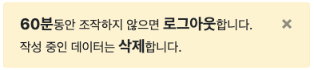

#### 참고
* [Understanding Success Criterion 2.2.6: Timeouts](https://www.w3.org/WAI/WCAG21/Understanding/timeouts.html)


### 2.3.3 Animation from Interactions (Level AAA)
#### 원문
> **2.3.3 Animation from Interactions (Level AAA)**<br>
> [Motion animation](https://www.w3.org/TR/WCAG21/#dfn-motion-animation) triggered by interaction can be disabled, unless the animation is [essential](https://www.w3.org/TR/WCAG21/#dfn-essential) to the functionality or the information being conveyed.

#### 번역
> **2.3.3. 상호작용 애니메이션 (Level AAA)**<br>
> 상호작용이 촉발하는 [모션 애니메이션](https://www.w3.org/TR/WCAG21/#dfn-motion-animation)은 기능 조작이나 정보 전달을 위해 [반드시 필요한](https://www.w3.org/TR/WCAG21/#dfn-essential) 경우가 아니라면 비활성화할 수 있어야 한다.

#### 해설
애니메이션은 전정 장애(평형 감각 이상)가 있는 사용자에게 주의 산만, 현기증, 두통, 메스꺼움을 유발할 수 있다. 흔히 페이지를 한쪽 방향으로 스크롤할 때 장식 요소들을 추가로 애니메이션 처리하는 경우(예를 들면 시차 애니메이션) 이런 문제를 유발할 수 있다.

이 성공 기준을 준수하면 애니메이션을 회피하고자 하는 사용자 설정을 존중하여 불필요한 애니메이션을 동작하지 않도록 처리할 수 있다.

[흔히 시차(Parallax) 스크롤 애니메이션으로 알려진 인터렉션 예: 배경과 본문 스크롤 속도가 다름.]<br>
<br>
출처 - [https://uxplanet.org/](https://uxplanet.org/best-practices-for-long-scrolling-256ffbd7aa12)

[제작자가 CSS 동작 감소 쿼리를 적용하면 사용자는 CSS 애니메이션을 차단할 수 있다.]
```css
@media (prefers-reduced-motion: reduce) {
    /* 동작 비활성 스타일 코드를 이 곳에 작성 */
}
```

웹 제작자가 CSS 동작 감소 쿼리를 설정하면 애니메이션을 회피하려는 사용자는 운영체제 설정에 따라 CSS 애니메이션을 보지 않아도 된다. 애니메이션을 회피하려는 사용자는 운영체제 설정에서 '동작 줄이기(MAC)' 옵션을 설정하거나 또는 '애니메이션(Windows)' 옵션을 해제한다. CSS 동작 감소 쿼리는 `prefers-reduced-motion: reduce` 조건문을 통해 사용자 운영체제에 동작 감지 옵션이 설정되어 있는지 판단할 수 있고 애니메이션을 끈 상태로 단순한 인터페이스를 제공할 수 있다.

[MAC OS: 손쉬운 사용 - 디스플레이 - 동작 줄이기 설정.]<br>
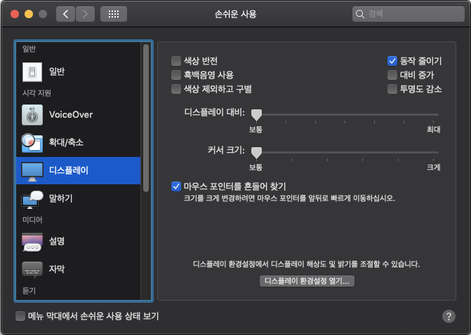<br>

[Windows OS: 고급 시스템 설정 - 창 최소화 또는 최대화 애니메이션 해제.]<br>
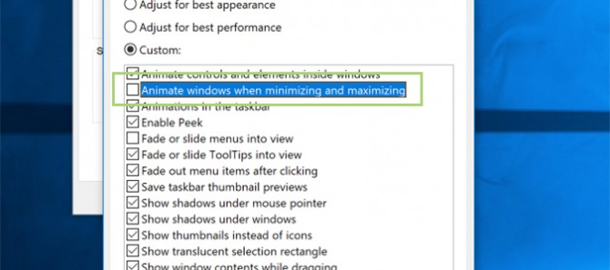<br>

#### 참고
* [Understanding Success Criterion 2.3.3: Animation from Interactions](https://www.w3.org/WAI/WCAG21/Understanding/animation-from-interactions.html)
* [Using the CSS reduce-motion query to prevent motion](https://www.w3.org/WAI/WCAG21/Techniques/css/C39)
* [MDN - prefers-reduced-motion](https://developer.mozilla.org/en-US/docs/Web/CSS/@media/prefers-reduced-motion)
* [Responsive Design for Motion](https://webkit.org/blog/7551/responsive-design-for-motion/)
* [Reduced Motion Demos](https://webkit.org/blog-files/prefers-reduced-motion/prm.htm)


### 2.5.1 Pointer Gestures (Level A)
#### 원문
> **2.5.1 Pointer Gestures (Level A)**<br>
> All [functionality](https://www.w3.org/TR/WCAG21/#dfn-functionality) that uses multipoint or path-based gestures for operation can be operated with a [single pointer](https://www.w3.org/TR/WCAG21/#dfn-single-pointer) without a path-based gesture, unless a multipoint or path-based gesture is [essential](https://www.w3.org/TR/WCAG21/#dfn-essential).
>
> **NOTE**<br>
> This requirement applies to web content that interprets pointer actions (i.e. this does not apply to actions that are required to operate the user agent or assistive technology).

#### 번역
> **2.5.1 포인터 제스처 (Level A)**<br>
> 멀티 포인트 또는 경로기반 제스처로 작동하는 모든 [기능](https://www.w3.org/TR/WCAG21/#dfn-functionality)은 경로기반 제스처 없이 [단일 포인터](https://www.w3.org/TR/WCAG21/#dfn-single-pointer)로 조작 가능해야 한다. 멀티 포인트 또는 경로기반 제스처가 [반드시 필요한](https://www.w3.org/TR/WCAG21/#dfn-essential) 경우는 예외.
>
> **참고**<br>
> 이 요구사항은 포인터의 액션을 해석하는 웹 콘텐츠에 적용한다(즉, 사용자 에이전트나 보조기기 조작을 요구하는 작업에 적용하지 않는다).

#### 해설
멀티 포인트(예: 핀치 줌)와 경로 기반 제스처(예: 스와이프, 드래그)는 단일 포인터로도 조작할 수 있어야 한다.

멀티 포인트의 대표적인 예는 핀치 줌이며, 경로 기반 제스처의 대표적인 예는 드래그 또는 스와이프(쓸어 넘기는 동작)이다. 키보드만으로 조작하거나 또는 헤드 포인터, 음성 제어 마우스 에뮬레이터 같은 보조기기를 사용하는 경우 단일 포인터 기능을 실행할 수 있지만 복잡한 포인터 제스처를 실행하기 어렵다.

이 지침을 준수하면 복잡한 포인터 제스처를 정확하게 수행할 수 없는 사용자에게 대체 수단을 제공할 수 있다. 더불어 인지 또는 학습 장애가 있는 사용자에게 손쉽고 익숙한 인터페이스를 제공할 수 있다.

[멀티 포인트(핀치 줌) 대신 단일 포인터로도 확대(+), 축소(-) 가능한 지도 인터페이스. 경로 기반 제스처(드래그) 대신 방향키(↑↓←→)를 이용하면 다른 지역으로 이동 가능.]<br>
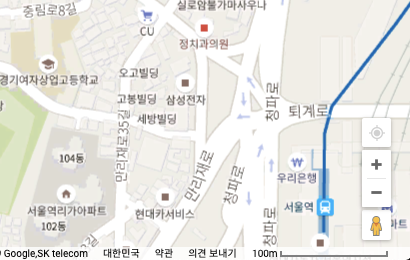<br>
출처 - [https://www.google.co.kr/maps/](https://www.google.co.kr/maps/@37.053745,125.6553969,5z?hl=ko)

[경로 기반 제스처(스와이프) 뿐만 아니라 단일 포인터로도 '이전, 다음' 콘텐츠를 표시할 수 있는 슬라이드.]<br>
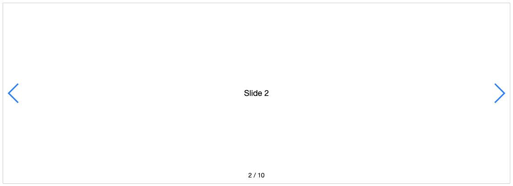<br>
출처 - [http://idangero.us/swiper/](http://idangero.us/swiper/demos/060-pagination-fraction.html)

[경로 기반 제스처(드래그) 대신 단일 포인터로도 증감(-, +) 조작 가능한 슬라이드 인풋.]<br>
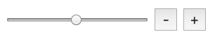<br>

#### 참고
* [Understanding Success Criterion 2.5.1: Pointer Gestures](https://www.w3.org/WAI/WCAG21/Understanding/pointer-gestures.html)
* [Swiper Demos](https://idangero.us/swiper/demos/)


### 2.5.2 Pointer Cancellation (Level A)
#### 원문
> **2.5.2 Pointer Cancellation (Level A)**<br>
> For [functionality](https://www.w3.org/TR/WCAG21/#dfn-functionality) that can be operated using a [single pointer](https://www.w3.org/TR/WCAG21/#dfn-single-pointer), at least one of the following is true:
>
> * **No Down-Event:** The [down-event](https://www.w3.org/TR/WCAG21/#dfn-down-event) of the pointer is not used to execute any part of the function;
> * **Abort or Undo:** Completion of the function is on the [up-event](https://www.w3.org/TR/WCAG21/#dfn-up-event), and a [mechanism](https://www.w3.org/TR/WCAG21/#dfn-mechanism) is available to abort the function before completion or to undo the function after completion;
> * **Up Reversal:** The up-event reverses any outcome of the preceding down-event;
> * **Essential:** Completing the function on the down-event is [essential](https://www.w3.org/TR/WCAG21/#dfn-essential).
>
> **NOTE**<br>
> Functions that emulate a keyboard or numeric keypad key press are considered essential.
>
> **NOTE**<br>
> This requirement applies to web content that interprets pointer actions (i.e. this does not apply to actions that are required to operate the user agent or assistive technology).

#### 번역
> **2.5.2 포인터 취소 (Level A)**<br>
> [단일 포인터](https://www.w3.org/TR/WCAG21/#dfn-single-pointer)로 조작할 수 있는 [기능](https://www.w3.org/TR/WCAG21/#dfn-functionality)은 다음 중 하나 이상 참어어야 한다.
>
> * **다운 이벤트 금지:** 포인터의 [다운 이벤트(down-event)](https://www.w3.org/TR/WCAG21/#dfn-down-event)는 어떤 기능도 실행하면 안 된다.
> * **중지 또는 취소:** [업 이벤트(up-event)](https://www.w3.org/TR/WCAG21/#dfn-up-event)에서 기능을 완료한다. 완료 전에 기능을 중지하거나 완료 후 취소할 수 있는 [메커니즘](https://www.w3.org/TR/WCAG21/#dfn-mechanism)이 있다.
> * **되돌리기 가능:** 업 이벤트는 앞서 실행한 다운 이벤트 결과를 되돌릴 수 있다.
> * **반드시 필요한:** 기능을 완료하는데 다운 이벤트가 [반드시 필요](https://www.w3.org/TR/WCAG21/#dfn-essential)하다.
>
> **참고**<br>
> 키보드 또는 숫자 키패드 키 누르기를 모방하는 기능은 필수적인 것으로 간주한다.
>
> **참고**<br>
> 이 요구사항은 포인터의 액션을 해석하는 웹 콘텐츠에 적용한다(즉, 사용자 에이전트나 보조기기 조작이 필요한 작업에 적용하지 않는다).

#### 해설
이 성공 기준은 단일 포인터 입력을 쉽게 취소할 수 있는 방법을 제시할 것을 요구한다. 단일 포인터 입력을 가장 쉽게 취소할 수 있는 방법은 업 이벤트(릴리즈)에서 기능을 활성화하는 것이다. 모든 기능을 `click` 이벤트로 실행하도록 구현하면 이 성공 기준을 만족할 수 있다. 결과적으로 다음 중 하나 이상 참이어야 한다.

* `onmousedown`, `ontouchstart` 이벤트에서 어떤 기능도 실행하지 않는다.
* `onclick`, `onmouseup`, `ontouchend` 이벤트에서 기능을 완료한다. 완료 전에 중지(abort)하거나 취소(undo)할 수 있다.
* `onmousedown`, `ontouchstart` 이벤트 결과는 `onmouseup`, `ontouchend` 이벤트로 되돌릴 수 있다.
* `onmousedown`, `ontouchstart` 이벤트가 반드시 필요하다. 예를 들면 사용자 정의 가상 키보드 또는 드래그 앤 드롭.

이 성공 기준은 단일 포인터를 정교하게 조작할 수 없는 시각, 인지, 운동 장애가 있는 사람이 복잡한 콘트롤을 잘못 조작했을 때 쉽게 중단하거나 취소할 수 있도록 돕는다.

[드래그 앤 드롭으로 조작할 수 있는 인터페이스 예제. 키보드만으로도 조작할 수 있다.]<br>
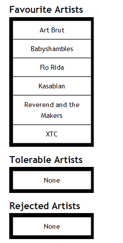
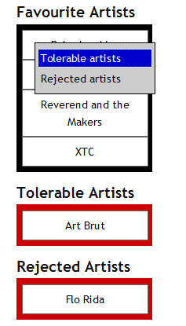<br>
출처 - [https://dev.opera.com/](https://dev.opera.com/articles/accessible-drag-and-drop/)

[접근 가능한 드래그 앤 드롭 예제 보기](https://dev.opera.com/articles/accessible-drag-and-drop/example.html) - 초점을 넣고 space 키를 누르면 콘텍스트 메뉴를 이용할 수 있다.

예제로 제시한 드래그 앤 드롭 인터페이스는 `onmousedown`, `ontouchstart` 이벤트가 반드시 필요하다. `onmousedown`, `ontouchstart` 이벤트를 사용하지만 `onmouseup`, `ontouchend` 이벤트에서 기능을 완료한다. `onmousedown`, `ontouchstart` 이벤트 결과는 `onmouseup`, `ontouchend` 이벤트로 되돌릴 수 있다. 뿐만 아니라 키보드만으로 조작 가능하다.

#### 참고
* [Understanding Success Criterion 2.5.2: Pointer Cancellation](https://www.w3.org/WAI/WCAG21/Understanding/pointer-cancellation.html)
* [Accessible Drag and Drop Using WAI-ARIA](https://dev.opera.com/articles/accessible-drag-and-drop/)


### 2.5.3 Label in Name (Level A)
#### 원문
> **2.5.3 Label in Name (Level A)**<br>
> For [user interface components](https://www.w3.org/TR/WCAG21/#dfn-user-interface-components) with [labels](https://www.w3.org/TR/WCAG21/#dfn-labels) that include [text](https://www.w3.org/TR/WCAG21/#dfn-text) or [images of text](https://www.w3.org/TR/WCAG21/#dfn-images-of-text), the [name](https://www.w3.org/TR/WCAG21/#dfn-name) contains the text that is presented visually.
>
> **NOTE**<br>
> A best practice is to have the text of the label at the start of the name.

#### 번역
> **2.5.3. 이름에 레이블 포함하기 (Level A)**<br>
> [텍스트](https://www.w3.org/TR/WCAG21/#dfn-text) 또는 [텍스트 이미지](https://www.w3.org/TR/WCAG21/#dfn-images-of-text)를 포함한 [레이블](https://www.w3.org/TR/WCAG21/#dfn-labels)이 있는 [사용자 인터페이스 구성요소](https://www.w3.org/TR/WCAG21/#dfn-user-interface-components)의 [이름](https://www.w3.org/TR/WCAG21/#dfn-name)은 볼 수 있는 텍스트를 포함해야 한다.
>
> **참고**<br>
> 이름 시작 부분에 레이블 텍스트를 두는 것이 가장 좋다.

#### 해설
지침 원문에서 쓰이는 레이블([label](https://www.w3.org/WAI/WCAG21/Understanding/label-in-name.html#dfn-label))과 이름([name](https://www.w3.org/TR/WCAG21/#dfn-name))은 HTML 요소나 속성을 의미하지 않으므로 해석할 때 유의해야 한다. 이름은 보조기기에 제공하는 사용자 인터페이스 구성요소 설명(화면 표시 여부가 선택적)이고 레이블은 모든 사용자에게 표시하는 텍스트 설명이다.

사용자 인터페이스 구성요소(링크 또는 폼 콘트롤)를 식별하기 위해 화면에 레이블(텍스트 설명, label 요소 아님)을 제공하는 경우 보조기기가 접근할 수 있는 이름(예: label/for, aria-labelledby, aria-label)과 일치해야 한다. 레이블과 이름이 일치하지 않는 경우 레이블은 접근 가능한 이름에 포함되어 있어야 한다.

시각적으로 드러난 레이블은 곧 텍스트 이름이어야 하고 프로그램 방식(예: label/for, aria-labelledby, aria-label)으로 결정해야 한다. 프로그램 방식으로 결정한 텍스트 이름은 화면에 드러난 레이블을 통해 음성 명령으로 접근 가능하다. 보이는 레이블이 프로그램 방식으로 결정한 텍스트 이름에 포함되지 않으면 이 성공 기준은 실패다. 보이는 레이블과 이름이 정확히 일치하지 않는 경우 레이블은 이름의 시작 부분에 배치하는 것이 좋다.

사용자 인터페이스 구성요소에 완전히 숨은 이름을 제공하는 경우 이 성공 기준을 적용하지 않는다. 이 성공 기준은 레이블이 화면에 보이는 경우에만 적용한다.

이 성공 기준을 준수하면 음성 입력 사용자는 사용자 인터페이스 구성요소에 접근할 수 있다. 또한 텍스트를 음성으로 듣는 사람은 드러난 레이블과 음성 설명이 일치하므로 혼란스럽지 않다.

**실패 사례:** 표시한 레이블과 구성요소의 이름이 다름.<br>
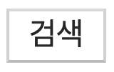
```html
<button aria-label="이 사이트에서 찾기">검색</button>
```
화면에는 '검색' 텍스트 레이블을 제공했으나 보조기기는 aria-label 속성에 더 높은 가중치를 두기 때문에 '이 사이트에서 찾기 클릭' 명령으로 검색을 시도해야 한다. 하지만 '이 사이트에서 찾기' 설명은 화면에 노출하지 않은 상태이기 때문에 음성 입력 사용자는 이용할 수 없다.

**실패 사례:** 표시한 레이블과 구성요소의 이름이 다름.<br>

```html
<div id="hidden-label">이 사이트에서 찾기</div>
<input type="submit" aria-labelledby="hidden-label" value="검색">
```
음성 입력 사용자는 '검색 클릭' 명령으로 검색을 시도하지만 보조기기는 `aria-labelledby` 속성에 더 높은 가중치를 두기 때문에 '이 사이트에서 찾기 클릭' 명령으로 검색을 시도해야 한다. 하지만 '이 사이트에서 찾기' 설명은 화면에서 숨겨진 상태이기 때문에 음성 입력 사용자는 이용할 수 없다.

**성공 사례:** 표시한 레이블과 구성요소의 이름 일치.<br>
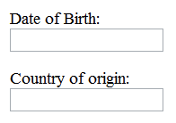
```html
<label for="birthday">Date of Birth:</label>
<input id="birthday" type="date">
<label for="country">Country of origin:</label>
<input id="country" type="date">
```

**성공 사례:** 표시한 레이블과 구성요소의 이름 일치.<br>
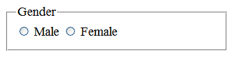
```html
<fieldset>
    <legend>Gender</legend>
    <input id="male" type="radio" name="gender">
    <label for="male">Male</label>
    <input id="female" type="radio" name="gender">
    <label for="female">Female</label>
</fieldset>
```

**성공 사례:** 표시한 레이블과 구성요소의 이름이 완전히 일치하지 않지만 레이블이 이름의 일부.<br>
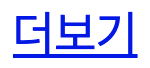
```html
<h2 id="notice">공지사항</h2>
...
<a href="#">더보기 <span class="a11y-hidden">공지사항</span></a> // 보이는 텍스트가 접근 가능한 이름의 시작과 일치
<a href="#" aria-labelledby="more notice"><span id="more">더보기</span></a> // 더보기 공지사항
<a href="#" aria-label="더보기 공지사항">더보기</a> // 더보기 공지사항
```
화면에는 '더보기' 설명만을 제공하지만 보조기기에는 '더보기 공지사항' 이라는 이름을 제공한다. 일반적으로 추천하지 않지만 보조기기 사용자에게 구체적인 설명을 제공하는 목적으로 허용하는 방식이다.

#### 참고
* [Understanding Success Criterion 2.5.3: Label in Name](https://www.w3.org/WAI/WCAG21/Understanding/label-in-name.html)
* [G162: Positioning labels to maximize predictability of relationships](https://www.w3.org/WAI/GL/2016/WD-WCAG20-TECHS-20160105/G162)
* [Failure due to "accessible name" not containing the visible label text](https://www.w3.org/WAI/WCAG21/Techniques/failures/F96)
* [Accessible Name and Description Computation](https://www.w3.org/TR/html-aam-1.0/#accessible-name-and-description-computation)


### 2.5.4 Motion Actuation (Level A)
#### 원문
> **2.5.4 Motion Actuation (Level A)**<br>
> [Functionality](https://www.w3.org/TR/WCAG21/#dfn-functionality) that can be operated by device motion or user motion can also be operated by [user interface components](https://www.w3.org/TR/WCAG21/#dfn-user-interface-components) and responding to the motion can be disabled to prevent accidental actuation, except when:
>
> * **Supported Interface:** The motion is used to operate functionality through an [accessibility supported](https://www.w3.org/TR/WCAG21/#dfn-accessibility-supported) interface;
> * **Essential:** The motion is [essential](https://www.w3.org/TR/WCAG21/#dfn-essential) for the function and doing so would invalidate the activity.

#### 번역
> **2.5.4. 모션기반 작동 (Level A)**<br>
> 장치 모션이나 사용자 모션으로 조작할 수 있는 [기능](https://www.w3.org/TR/WCAG21/#dfn-functionality)은 [사용자 인터페이스 구성요소](https://www.w3.org/TR/WCAG21/#dfn-user-interface-components)로 조작할 수 있어야 한다. 그리고 의도하지 않은 조작을 예방하기 위해 모션 응답을 끌 수 있어야 한다. 다음 경우는 예외.
>
> * **지원 인터페이스:** 모션이 [접근성 지원](https://www.w3.org/TR/WCAG21/#dfn-accessibility-supported) 인터페이스를 통해 기능을 조작하는데 사용됨. 또는
> * **반드시 필요한:** 모션이 기능에 [반드시 필요](https://www.w3.org/TR/WCAG21/#dfn-essential)하고, 모션으로 활동을 무효화할 수 있다.

#### 해설
장치 모션(흔들기, 기울이기 등) 또는 장치를 향한 제스쳐로 조작할 수 있는 기능은 전통적인 방식(링크 또는 폼 콘트롤)으로도 조작할 수 있어야 한다. 우발적으로 기능을 실행할 수 있기 때문에 응용 프로그램 또는 시스템 수준에서 모션 실행 기능을 끌 수 있어야 한다.

휴대전화 또는 태블릿에 탑재되어 있는 가속도계, 자이로 스코프, 카메라 등 센서는 움직임을 통해 웹 콘텐츠를 조작할 수 있다. 장치를 흔들어서 실행을 취소하거나 손을 흔들어서 페이지를 앞뒤로 이동할 수 있다. 일부 사용자는 장치를 휠체어 등에 고정하기 때문에 장치 모션을 이용할 수 없고 일부 사용자는 운동 장애로 정교한 제스쳐를 실행할 수 없다.

이 성공 기준은 기울기, 흔들기, 몸짓 등 동작을 수행하기 어려운 사람들을 돕는다. 이 성공 기준을 준수하면 사용자는 모션 대신 터치 또는 음성 입력 등 전통적인 방법으로 기능을 작동할 수 있다.

다음은 성공 기준을 만족하는 사례.

* 장치를 흔들면 입력을 취소할 수 있는 대화 상자를 표시하는 경우 입력 필드 옆에 취소 버튼을 제공해야 한다.
* 장치를 기울여 이전 또는 다음 페이지로 이동할 수 있다면 동일한 기능을 제공하는 버튼 또는 링크를 제공해야 한다.
* 장치를 회전하여 파노라마 사진을 볼 수 있다면 동일한 기능을 수행하는 컨트롤을 제공해야 한다.
* 공중에서 손바닥을 쓸어 넘기는 동작으로 탐색할 수 있다면 동일한 기능을 수행하는 컨트롤을 제공해야 한다.
* 장치를 흔들어서 취소하는 기능을 응용 프로그램 또는 시스템 수준에서 끌 수 있어야 한다.

[장치를 회전하면 파노라마 영상을 볼 수 있다. 좌우로 쓸어 넘기거나 또는 버튼 컨트롤을 조작하는 방법으로도 볼 수 있어야 한다.]<br>
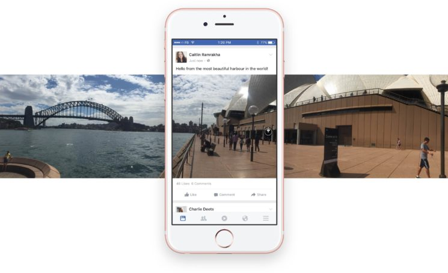<br>
출처 - [https://www.idownloadblog.com/](https://www.idownloadblog.com/2016/06/09/facebook-panoramic-photos/)

[장치를 흔들어서 Undo/Redo 기능을 실행하는 응용 프로그램 사례. 우발적으로 실행한 동작일 수 있기 때문에 확인 대화상자를 통해 취소할 수 있다.]<br>
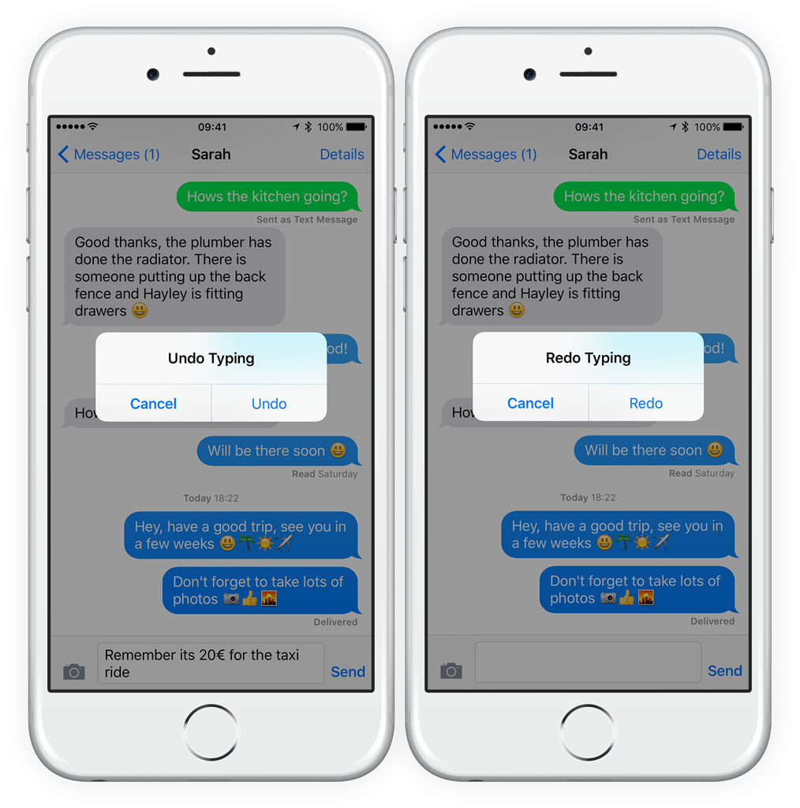<br>
출처 - [https://www.tapsmart.com/](https://www.tapsmart.com/tips-and-tricks/shaketoundo/)

[장치를 흔들어서 실행 취소하는 기능을 시스템 수준에서 끌 수 있다.]<br>
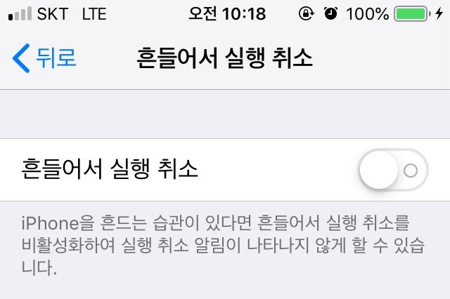<br>

#### 참고
* [Understanding Success Criterion 2.5.4: Motion Actuation](https://www.w3.org/WAI/WCAG21/Understanding/motion-actuation.html)


### 2.5.5 Target Size (Level AAA)
#### 원문
> **2.5.5 Target Size (Level AAA)**<br>
> The size of the [target](https://www.w3.org/TR/WCAG21/#dfn-target) for [pointer inputs](https://www.w3.org/TR/WCAG21/#dfn-pointer-inputs) is at least 44 by 44 [CSS pixels](https://www.w3.org/TR/WCAG21/#dfn-css-pixels) except when:
>
> * **Equivalent:** The target is available through an equivalent link or control on the same page that is at least 44 by 44 CSS pixels;
> * **Inline:** The target is in a sentence or block of text;
> * **User Agent Control:** The size of the target is determined by the user agent and is not modified by the author;
> * **Essential:** A particular presentation of the target is [essential](https://www.w3.org/TR/WCAG21/#dfn-essential) to the information being conveyed.

#### 번역
> **2.5.5 타겟 크기 (Level AAA)**<br>
> [포인터 입력](https://www.w3.org/TR/WCAG21/#dfn-pointer-inputs)용 [타겟](https://www.w3.org/TR/WCAG21/#dfn-target) 크기는 최소 44*44 [CSS 픽셀](https://www.w3.org/TR/WCAG21/#dfn-css-pixels)이어야 한다. 다음 경우는 예외.
>
> * **동등한(equivalent):** 동일 페이지에서 최소 44*44 CSS 픽셀의 동등한 링크 또는 콘트롤 이용 가능한 타겟 또는
> * **인라인(Inline):** 타겟이 문장 또는 텍스트 블록 내부에 있는 경우 또는
> * **사용자 에이전트 콘트롤:** 타겟 크기를 사용자 에이전트가 결정하고 제작자가 수정할 수 없는 경우 또는
> * **필수적인:** 타겟의 특정 표현이 정보 전달에 [반드시 필요](https://www.w3.org/TR/WCAG21/#dfn-essential)한 경우

#### 해설
사용자 인터페이스 구성요소(링크와 폼 콘트롤)의 크기는 최소한 44*44 CSS 픽셀으로 제공해야 한다.

같은 페이지에 있는 동일한 링크 또는 콘트롤이 44*44 픽셀 이상이면 예외. 문장 속 텍스트의 일부인 경우 예외. 사용자 에이전트 콘트롤로 크기를 변경할 수 없는 경우 예외. 작은 크기가 정보 전달을 위해 반드시 필요한 경우 예외.

이 성공 기준을 준수하면 정교한 포인팅이 어려운 사용자라도 소형 모바일 장치에서 타겟을 손쉽게 제어할 수 있다.

[애플은 터치 콘트롤 크기를 최소 44*44 픽셀으로 권장한다.]<br>
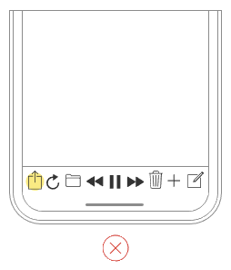
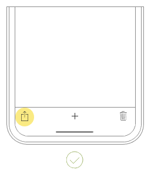<br>
출처 - [https://developer.apple.com/](https://developer.apple.com/design/human-interface-guidelines/ios/visual-design/adaptivity-and-layout#general-layout-considerations)

[안드로이드는 터치 콘트롤 크기를 최소 48*48 픽셀로 권장한다.]<br>
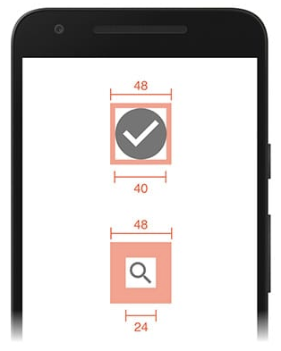<br>
출처 - [https://developers.google.com/](https://developers.google.com/web/fundamentals/accessibility/accessible-styles#multi-device_responsive_design)

#### 참고
* [Understanding Success Criterion 2.5.5: Target Size](https://www.w3.org/WAI/WCAG21/Understanding/target-size.html)


### 2.5.6 Concurrent Input Mechanisms (Level AAA)
#### 원문
> **2.5.6 Concurrent Input Mechanisms (Level AAA)**<br>
> Web content does not restrict use of input modalities available on a platform except where the restriction is [essential](https://www.w3.org/TR/WCAG21/#dfn-essential), required to ensure the security of the content, or required to respect user settings.

#### 번역
> **2.5.6 다양한 입력 메커니즘 (Level AAA)**<br>
> 웹 콘텐츠는 플랫폼에서 사용 가능한 입력 방식을 제한하지 않아야 한다. 제한이 [반드시 필요한](https://www.w3.org/TR/WCAG21/#dfn-essential) 경우, 콘텐츠 보안 유지를 위해, 사용자 설정을 존중할 필요가 있는 경우 예외.

#### 해설
이 성공 기준은 플랫폼이 제공하는 다양한 입력 방식을 제한하지 않도록 요구한다. 이 성공 기준을 준수하면 상황에 따라 사용자가 선호하는 입력 메커니즘으로 변경하여 상호작용할 수 있다.

사용자는 입력 방식을 터치에서 키보드로 변경할 수 있기 때문에 처음에 터치 입력을 실행했다고 해서 터치 이외 다른 입력 방식을 사용하지 않을 것으로 추정하면 안 된다. 사용자는 키보드, 가상 키보드, 마우스, 스타일러스 펜, 터치, 음성 등 다양한 입력 장치를 단말에 연결하여 사용할 수 있다.

예를 들면 휴대용 단말에도 외장 키보드와 마우스를 연결할 수 있기 때문에 touch 이벤트만 처리하도록 구현하면 안 된다. 장치 독립 이벤트 핸들러인 `onclick`, `onfocus`, `onblur`, `oninput`, `onchange`, `onselect`를 사용하는 것이 가장 좋다. 참고로 더블 클릭에 해당하는 장치 독립 이벤트 핸들러는 없으므로 피해야 한다. 장치 독립 이벤트 핸들러는 특정 입력 장치에 의존하지 않는 이벤트 핸들러를 말한다.

또는 대체 입력 수단을 제공할 수 있다. 예를 들어 `onmouseover`가 특정 기능을 실행하는 경우 장치 독립 이벤트 핸들러인 `onfocus`가 같은 동작을 실행하도록 구현하면 된다.

**장치 독립 이벤트 핸들러(권장)**
```html
onblur
onchange
onclick
onfocus
oninput
onselect
```

**장치 종속 이벤트 핸들러(권장하지 않음)**
```html
ondblclick
onkeydown
onkeypress
onkeyup
onmousedown
onmouseenter
onmouseleave
onmousemove
onmouseout
onmouseover
onmouseup
touchstart
touchend
touchmove
touchcancel
```

#### 참고
* [Understanding Success Criterion 2.5.6: Concurrent Input Mechanisms](https://www.w3.org/WAI/WCAG21/Understanding/concurrent-input-mechanisms.html)
* [WebAIM - JavaScript Event Handlers](https://webaim.org/techniques/javascript/eventhandlers)
* [Touch Events - List of TouchEvent types](https://www.w3.org/TR/touch-events/#list-of-touchevent-types)


### 4.1.3 Status Messages (Level AA)
#### 원문
> **4.1.3 Status Messages (Level AA)**<br>
> In content implemented using markup languages, [status messages](https://www.w3.org/TR/WCAG21/#dfn-status-messages) can be [programmatically determined](https://www.w3.org/TR/WCAG21/#dfn-programmatically-determinable) through [role](https://www.w3.org/TR/WCAG21/#dfn-role) or properties such that they can be presented to the user by [assistive technologies](https://www.w3.org/TR/WCAG21/#dfn-assistive-technologies) without receiving focus.

#### 번역
> **4.1.3 상태 메시지 (Level AA)**<br>
> 마크업 언어를 사용하여 구현한 콘텐츠에서 [상태 메시지](https://www.w3.org/TR/WCAG21/#dfn-status-messages)는 [역할](https://www.w3.org/TR/WCAG21/#dfn-role)이나 속성을 통해 [프로그램으로 결정](https://www.w3.org/TR/WCAG21/#dfn-programmatically-determinable)하고 포커스를 받지 않은 채 [보조기술](https://www.w3.org/TR/WCAG21/#dfn-assistive-technologies)을 통해 사용자에게 전달할 수 있다.

#### 해설
이 성공 기준은 사용자의 현재 작업을 방해하지 않고(초점 변화 없이) 현재 페이지 내용 변경(성공, 결과, 대기, 진행, 오류, 제안)을 상태 메시지를 통해 사용자에게 전달하는 것을 의도한다. '유저 에이전트, 뷰포트, 촛점, 웹 페이지 의미'가 달라지는 경우는 문맥 변경(change of context)으로써 내용 변경(change of content)에 해당하지 않는다. 이 성공 기준은 내용 변경을 다룬다.

초점을 받지 않는 메시지 영역에 실시간 영역 역할(Live Region Roles) `role="alert"`, `role="status"`, `role="log"`을 부여하여 화면 낭독기 사용자가 문맥을 변경하지 않고도 내용 변경을 알 수 있어야 한다.

이 성공 기준에서 상태 메시지는 내용 변경에 대한 '성공, 결과, 대기, 진행, 오류, 제안' 정보로 한정한다. 상태 메시지는 화면에 노출하는 경우도 있고 노출하지 않는 경우도 있다. 제작자는 실시간 영역(`role`이 `alert`, `status`, `log`인 경우)에 초점을 받게 하면 안 된다. 초점을 변경하는 경우 내용 변경이 아닌 문맥 변경으로 간주하기 때문에 이 성공 기준에서 다루지 않는다.

**상태 메시지(`role="alert"`): 오류, 제안**<br>
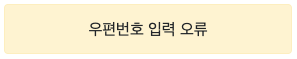<br>
오류 메시지에 `role="alert"` 속성을 부여하면 `aria-live="assertive"`, `aria-atomic="true"` 속성을 암시적으로 부여한다. 즉, `role="alert"` 상태 메시지 일부를 업데이트하면 화면 낭독기는 `role="alert"` 컨테이너에 초점을 옮기지 않은 상태로 현재 진행 중인 음성 안내를 즉시 중단하고 `role="alert"` 컨테이너 전체 텍스트를 음성으로 낭독한다.

**상태 메시지(`role="status"`): 성공, 결과**<br>
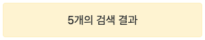<br>
성공, 결과 메시지에 `role="status"` 속성을 부여하면 `aria-live="polite"`, `aria-atomic="true"` 속성을 암시적으로 부여한다. 즉, `role="status"` 상태 메시지 일부를 업데이트하면 화면 낭독기는 `role="status"` 컨테이너에 초점을 옮기지 않은 상태로 현재 진행 중인 음성 안내를 끝낸 후 `role="status"` 컨테이너 전체 텍스트를 음성으로 낭독한다.

**상태 메시지(`role="log"`): 대기, 진행**<br>
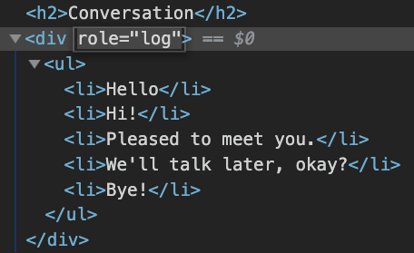<br>
대기, 진행 메시지에 `role="log"` 속성을 부여하면 `aria-live="polite"`, `aria-atomic="false"` 속성을 암시적으로 부여한다. 즉, `role="log"` 상태 메시지 일부를 업데이트하면 화면 낭독기는 `role="log"` 컨테이너에 초점을 옮기지 않은 상태로 현재 진행 중인 음성 안내를 끝낸 후 `role="log"` 컨테이너 내부 변경 텍스트만 음성으로 낭독한다.

내용 변경에 따른 상태 메시지 제공 모범 사례.

* 잘못된 우편번호를 입력하면 `role="alert"` 요소에 "우편번호 입력 오류." 메시지 추가.
* 유효하지 않은 데이터를 입력하면 `role="alert"` 요소에 "XXX 입력 오류" 메시지 추가.
* 채팅 내역을 표시하는 `role="log"` 요소에 "Bye!" 메시지 추가.
* '검색' 버튼을 누르면 `role="status"` 요소에 "5개의 검색 결과" 메시지 추가.
* '장바구니에 추가' 버튼을 누르면 `role="status"` 요소는 "장바구니 항목 다섯 개"으로 메시지 갱신.
* 양식을 제출하면 `role="status"` 요소에 "양식 제출 성공" 메시지 추가.
* 앨범에 사진을 추가하면 `role="status"` 요소에 "앨범에 사진 X장 저장" 메시지 추가.

문맥 변경(change of context)은 내용 변경(change of content)과 다르다. 문맥 변경은 '유저 에이전트, 뷰포트, 촛점, 웹 페이지 의미'가 달라지는 경우를 의미한다. 문맥 변경은 이 성공 기준에서 다루지 않는다. 이 성공 기준에서 평가하지 않는 사례는 다음과 같다.

* 대화 상자를 통해 오류 메시지를 표시하는 경우 대화 상자는 촛점을 받기 때문에 문맥 변경이고 상태 메시지로 간주하지 않는다. 촛점 변화는 화면 낭독기에 이미 문맥 변화를 알리기 때문.
* 메뉴, 셀렉트, 아코디언, 트리, 탭과 같은 사용자 인터페이스 구성요소를 통해 내용을 숨기거나 노출하는 경우 이미 `aria-expanded` 속성을 통해 "펼침(`expanded`)" 또는 "접힘(`collapede`)" 메시지를 전달하므로 별도의 상태 메시지 제공 필요 없음.
* 사용자가 '불만족' 라디오 버튼에 체크하면 새로운 텍스트 입력 양식이 페이지에 추가된다. 이런 콘텐츠 변경 상황은 상태(성공, 결과, 대기, 진행, 오류, 제안) 메시지를 제공해야 하는 상황이 아니기 때문에 예외. 하지만 이런 경우에도 상태 메시지를 제공한다면 모범 사례가 될 수 있다.

#### 참고
* [Understanding Success Criterion 4.1.3: Status Messages](https://www.w3.org/WAI/WCAG21/Understanding/status-messages.html)
* [WAI-ARIA - alert(role)](https://www.w3.org/TR/wai-aria-1.1/#alert )
* [WAI-ARIA - status(role)](https://www.w3.org/TR/wai-aria-1.1/#status )
* [WAI-ARIA - log(role)](https://www.w3.org/TR/wai-aria-1.1/#log)
